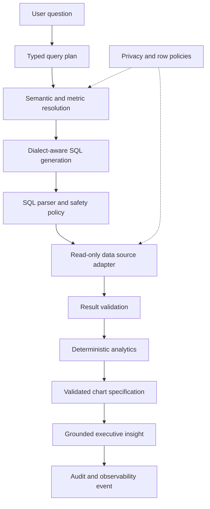

# Avrixo DataAgent

### Governed AI Analytics & BI Platform

A governed AI analytics platform that translates natural-language business questions into validated read-only queries, semantic metrics, charts, and grounded executive insights.

## Upstream & Fork Scope

This project is a customized derivative of [vercel-labs/oss-data-analyst](https://github.com/vercel-labs/oss-data-analyst).

The original sandboxed analytics foundation, inherited code, Git history, and upstream implementation remain credited to Vercel Labs and contributors. The fork preserves the original MIT license and GitHub fork relationship.

Avrixo-specific engineering is documented in [FORK_CHANGES.md](FORK_CHANGES.md). The exact audited upstream revision is recorded in [UPSTREAM.md](UPSTREAM.md).

## What This Fork Adds

- Typed question-to-plan-to-query pipeline with configurable confidence gates
- Programmatic SQL parser validation, SELECT-only enforcement, single-statement checks, row caps, and timeouts
- SQLite adapter using a read-only worker that can be terminated at the timeout boundary
- PostgreSQL adapter using `BEGIN READ ONLY`, transaction-local statement timeout, parameter binding, and rollback
- Validated semantic entities and governed, versioned sample metric definitions
- Metric resolution that prefers an approved metric over an invented formula
- Privacy-aware schema exposure plus a reusable parameterized row-policy abstraction
- Deterministic statistics, period-over-period change, ranking, trend, and documented anomaly flags
- Chart specifications validated against actual result columns and rendered through a controlled bar/line component
- Numeric insight grounding against query results and computed analytics
- Sanitized typed audit events, lightweight observability, and reviewable bounded analysis history
- Deterministic evaluation and end-to-end flows that need no paid model or production database
- Fork-specific CI for formatting, linting, types, tests, evaluation, build, secret scanning, and docs

All bundled metrics and records are sample data. They are not production claims about Avrixo or any customer.

## Governed Flow



See [docs/architecture.md](docs/architecture.md) for components and trust boundaries.

## Quick Start

Prerequisites:

- Node.js 20
- pnpm 8.15

```bash
pnpm install
pnpm initDatabase
pnpm dev
```

Open `http://localhost:3000`. The governed demo endpoint supports these deterministic sample questions:

- `Show monthly revenue trend`
- `Top 5 companies by revenue`

`Delete all customers` is included as a negative path and is rejected before any database execution.

The inherited AI-assisted chat route remains available for optional experimentation and can use the Vercel AI SDK. Automated tests and CI do not invoke paid models or require Vercel credentials.

## Data Sources

The common `DataSourceAdapter` contract exposes schema introspection, health checks, capabilities, dialect, and bounded read-only execution.

- SQLite: local, file-backed, `query_only`, read-only connection, outer row cap, and worker termination on timeout
- PostgreSQL: connection-pool adapter, read-only transaction, local statement timeout, parameters, and unconditional rollback

CI validates PostgreSQL protocol behavior with an injected deterministic client. It does not claim integration against a production PostgreSQL server.

## Semantic and Privacy Governance

`src/semantic/entities/` contains the inherited YAML entity definitions. `src/semantic/metrics.yml` adds versioned governed sample metrics with owner, source, formula, synonyms, and allowed dimensions. Validation detects duplicate metric names, unknown dimensions, broken joins, and unknown expression fields.

`src/semantic/privacy.yml` marks sample PII and restricted fields. Model-visible schema filters omit forbidden fields and never attach row samples. A reusable row-policy builder produces parameterized tenant predicates, but this repository does not claim enterprise authentication or complete multi-tenancy.

## Validation

```bash
pnpm format
pnpm lint
pnpm type-check
pnpm test
pnpm validate:semantic
pnpm evaluate
pnpm e2e
pnpm build
pnpm scan:secrets
pnpm validate:docs
```

The deterministic suite covers destructive-operation rejection, multiple-statement rejection, unsafe SQLite commands, SQLite and PostgreSQL adapters, row limits, timeout behavior, semantic and privacy validation, chart columns, numeric grounding, auditing, redaction, analytics, failure handling, and the complete safe/unsafe E2E paths.

## Security Position

The model never grants execution authority. SQL is parsed and rejected programmatically before an adapter connects. Database credentials are supplied only through runtime configuration and are not written to audit events. See [docs/security.md](docs/security.md) for implemented controls, residual risks, and deployment responsibilities.

This project does not claim GDPR, HIPAA, or SOC 2 compliance.

## Documentation

- [Architecture](docs/architecture.md)
- [Security](docs/security.md)
- [Development](docs/development.md)
- [Upstream revision](UPSTREAM.md)
- [Fork changes](FORK_CHANGES.md)

## License and Attribution

Licensed under the inherited [MIT License](LICENSE), copyright 2025 Vercel. Avrixo additions are distributed under the same repository license. No inherited Vercel Labs code is claimed as original Avrixo work.
