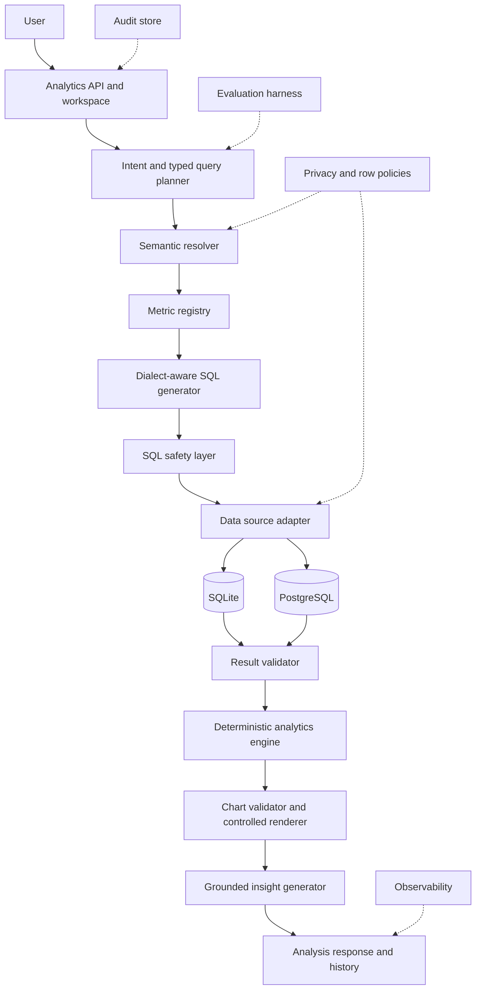
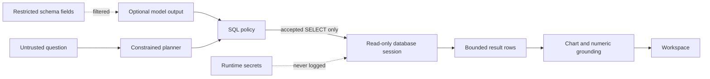

# Architecture

## Governed Analytics Pipeline

## Components

The deterministic path begins at `POST /api/analyze`. A typed planner resolves a registered metric, emits a bounded plan, and requires sufficient confidence. The compiler supports only registered deterministic query shapes. This narrow surface is intentional: unsupported questions request clarification instead of creating uncontrolled SQL.

`validateReadOnlySql` parses the candidate for the selected dialect, rejects multiple statements and forbidden operations, requires a `select` AST root, and wraps the statement in an outer result cap. The adapters independently enforce database-side read-only behavior and time bounds.

The SQLite adapter opens the database read-only inside a worker, enables `query_only`, disables trusted-schema execution, and terminates the worker on timeout. The PostgreSQL adapter opens a read-only transaction, sets a transaction-local statement timeout, executes parameters separately, and always rolls back.

Result columns govern chart validity. The UI renders the accepted bar or line specification with the already validated rows. Deterministic analytics compute statistics and trends. The insight generator separates facts, observations, and interpretation, then checks every numeric token against result or computed evidence before returning it.

## Trust Boundaries

Questions and optional model output are untrusted. The SQL policy, not a prompt, is the authority boundary. Database roles remain a separate deployment control. Query results are bounded before they can enter analytics or model context. Credentials never enter plans or audit events.

## Persistence and History

The demo UI keeps a bounded client-session history. `JsonlAuditStore` provides an append-only local option with restrictive creation mode. Serverless and multi-node deployments must supply a durable centralized audit implementation. PostgreSQL is a query data source, not application persistence.

## Inherited Sandbox Trade-off

The upstream Vercel Sandbox module remains for attribution and trusted experiments. The Avrixo deterministic path does not expose general shell commands to user questions. Structured semantic catalog reads replace raw shell exploration. This reduces flexibility but creates a stronger, testable trust boundary.
